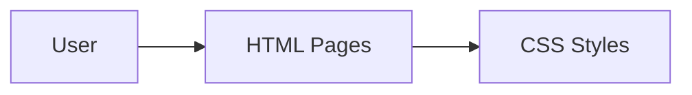

# Sports Club Website (Learning Assignment)

This project is a simple "Sports Club" website created as a learning assignment for beginner web development. The main focus is on practicing basic HTML and CSS skills and understanding how web pages are structured.

## Learning Objective

- Practice writing and organizing HTML structure for web pages.
- Learn the basics of styling using CSS.
- Understand simple website folder and file organization.
- Explore adding basic images and JavaScript files (optional/bonus).

## Technologies Used

- **HTML5** (for web page structure)
- **CSS3** (for styling)
- *Very basic use of JavaScript (if any)*
- Images for design and content

## Features

- Simple, static webpages for a sports club
- Separate CSS files for styling different sections
- Images included for visual appeal
- Organized folders for CSS, JS, images, and pages

## Folder Structure

```
E-Project---Sports-Club/
├── assests/
│   ├── css/
│   ├── images/
│   ├── js/
│   ├── pages/
│   └── index.html
```

- `assests/css/` — All CSS stylesheets
- `assests/js/`  — JavaScript files (if any, likely minimal or empty)
- `assests/images/` — All images used
- `assests/pages/` — Additional HTML pages (if any)
- `assests/index.html` — Main homepage file

## How to Open / Run the Project

1. Download or clone this repo to your computer.
2. Open `assests/index.html` in your web browser.
3. Explore and view the static pages/styles.

No special setup or server is needed. Just a web browser!

## Notes

- This project is for educational purposes, not for production.
- The code style and structure are kept simple for learning.
- Please review the folders and code for practice and improvement ideas.

## Future Learning Goals (optional)

- Add navigation between pages using real HTML links.
- Make the website responsive (viewable on mobile).
- Practice using more advanced CSS, layout, or JavaScript.

---

## Simple Architecture Diagram


